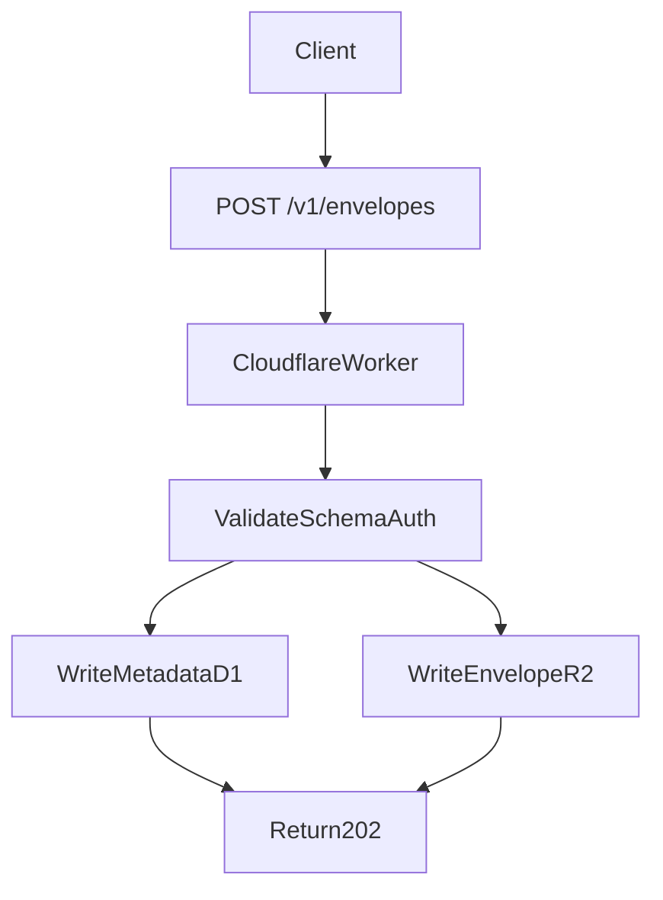
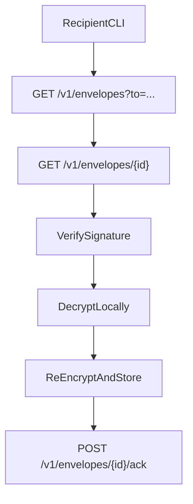

# Himitsu Server API (v1 Draft)

This document specifies a compatible HTTP server for Himitsu sharing workflows.
It is designed to run well on Cloudflare Workers and remain transport-neutral
with the protocol in `docs/SHARING.md`.

Server role:

- Accept signed encrypted envelopes.
- Store and index envelopes for recipient polling.
- Track recipient acknowledgements and replay metadata.

Server non-role:

- Never decrypt payloads.
- Never hold recipient private keys.

## 1) Compatibility Contract

The server is compatible if it can:

1. Accept a valid `himitsu.envelope`.
2. Return envelopes by recipient identifier.
3. Return a specific envelope by ID.
4. Record recipient ack/nack state.
5. Preserve envelope bytes exactly as submitted.

## 2) Base URL, Versioning, and Content Types

- Base URL example: `https://inbox.example.com`
- API prefix: `/v1`
- Request/response content type: `application/json`
- Character encoding: UTF-8

Versioning rule:

- Backward-compatible additions stay in `v1`.
- Breaking changes require `v2`.

## 3) Authentication and Authorization

Recommended auth modes:

1. **Bearer token (default):**
   - `Authorization: Bearer <token>`
   - Token scoped to tenant and operation (`ingest`, `poll`, `ack`).
2. **Public ingest mode (optional):**
   - No auth for `POST /v1/envelopes`.
   - Strict rate limits + abuse controls required.
3. **mTLS (optional enterprise mode):**
   - Strong sender identity and network-level controls.

Minimum authorization checks:

- Ingest caller can submit for target tenant.
- Poll caller can read only allowed recipient namespace.
- Ack caller can ack only envelopes addressed to that recipient.

## 4) Common JSON Structures

### 4.1 Envelope (submitted and returned)

The server accepts the exact object defined by `himitsu.envelope` in
`docs/SHARING.md`.

### 4.2 Standard error response

```json
{
  "error": {
    "code": "invalid_envelope",
    "message": "Envelope schema validation failed",
    "details": {
      "field": "sig.value"
    }
  },
  "request_id": "req_01HV..."
}
```

### 4.3 Standard pagination response

```json
{
  "items": [],
  "next_cursor": "eyJ0cyI6IjIwMjYtMDMtMDRUMTI6MDA6MDBaIiwiaWQiOiIwMThmLi4uIn0="
}
```

## 5) Endpoints

## `GET /v1/health`

Health and metadata probe.

Response `200`:

```json
{
  "status": "ok",
  "service": "himitsu-server",
  "version": "0.1.0",
  "time": "2026-03-04T12:34:56Z"
}
```

---

## `POST /v1/envelopes`

Submit one envelope.

Headers:

- `Authorization: Bearer <token>` (unless public ingest mode)
- `Content-Type: application/json`
- `Idempotency-Key: <opaque-string>` (recommended)

Request body:

```json
{
  "v": 1,
  "type": "himitsu.envelope",
  "id": "018fa4f4-d9c3-7c02-b0e5-9c1f48d0b2e1",
  "to": ["did:key:z6MkRecipient"],
  "from": "did:key:z6MkSender",
  "ciphertext": {
    "kind": "embedded_age",
    "data": "-----BEGIN AGE ENCRYPTED FILE-----\n...\n-----END AGE ENCRYPTED FILE-----",
    "sha256": "4a7c..."
  },
  "meta": {
    "label": "vars/prod/STRIPE_WEBHOOK_SECRET",
    "created_at": "2026-03-04T10:12:00Z",
    "expires_at": "2026-03-11T10:12:00Z"
  },
  "sig": {
    "alg": "ed25519",
    "key_id": "did:key:z6MkSender#signing-1",
    "value": "base64(signature)"
  }
}
```

Response `202` (new ingest):

```json
{
  "id": "018fa4f4-d9c3-7c02-b0e5-9c1f48d0b2e1",
  "status": "accepted",
  "duplicate": false,
  "stored_at": "2026-03-04T10:12:05Z",
  "request_id": "req_01HV..."
}
```

Response `200` (idempotent duplicate):

```json
{
  "id": "018fa4f4-d9c3-7c02-b0e5-9c1f48d0b2e1",
  "status": "accepted",
  "duplicate": true,
  "request_id": "req_01HV..."
}
```

Validation requirements:

- `type` must be `himitsu.envelope`.
- `id` must be unique per tenant (or match idempotent replay).
- envelope size within configured limit.
- optional: signature pre-check at ingest.

---

## `GET /v1/envelopes?to=<recipient>&cursor=<cursor>&limit=<n>`

List envelopes addressed to a recipient.

Query params:

- `to` (required): recipient ID (`did:key:...`, `npub...`, etc.)
- `cursor` (optional): opaque pagination cursor
- `limit` (optional): default `50`, max `200`

Response `200`:

```json
{
  "items": [
    {
      "id": "018fa4f4-d9c3-7c02-b0e5-9c1f48d0b2e1",
      "received_at": "2026-03-04T10:12:05Z",
      "from": "did:key:z6MkSender",
      "to": ["did:key:z6MkRecipient"],
      "meta": {
        "label": "vars/prod/STRIPE_WEBHOOK_SECRET",
        "expires_at": "2026-03-11T10:12:00Z"
      },
      "ack_status": "pending"
    }
  ],
  "next_cursor": "eyJ0cyI6IjIwMjYtMDMtMDRUMTA6MTI6MDVaIiwiaWQiOiIwMThmLi4uIn0="
}
```

Notes:

- This endpoint may return metadata-only items for efficiency.
- Full envelope body is fetched via `GET /v1/envelopes/{id}`.

---

## `GET /v1/envelopes/{id}`

Fetch full envelope by ID.

Response `200`:

```json
{
  "envelope": {
    "v": 1,
    "type": "himitsu.envelope",
    "id": "018fa4f4-d9c3-7c02-b0e5-9c1f48d0b2e1",
    "to": ["did:key:z6MkRecipient"],
    "from": "did:key:z6MkSender",
    "ciphertext": {
      "kind": "embedded_age",
      "data": "-----BEGIN AGE ENCRYPTED FILE-----\n...\n-----END AGE ENCRYPTED FILE-----",
      "sha256": "4a7c..."
    },
    "meta": {
      "label": "vars/prod/STRIPE_WEBHOOK_SECRET",
      "created_at": "2026-03-04T10:12:00Z",
      "expires_at": "2026-03-11T10:12:00Z"
    },
    "sig": {
      "alg": "ed25519",
      "key_id": "did:key:z6MkSender#signing-1",
      "value": "base64(signature)"
    }
  },
  "ack": {
    "status": "pending",
    "updated_at": null
  },
  "request_id": "req_01HV..."
}
```

---

## `POST /v1/envelopes/{id}/ack`

Record recipient processing result.

Request body:

```json
{
  "recipient": "did:key:z6MkRecipient",
  "status": "accepted",
  "reason": null,
  "processed_at": "2026-03-04T10:15:12Z",
  "client_ref": "inbox_local_42"
}
```

`status` values:

- `accepted`
- `rejected`
- `deferred`

Response `200`:

```json
{
  "id": "018fa4f4-d9c3-7c02-b0e5-9c1f48d0b2e1",
  "recipient": "did:key:z6MkRecipient",
  "status": "accepted",
  "recorded_at": "2026-03-04T10:15:13Z",
  "request_id": "req_01HV..."
}
```

## 6) HTTP Status Codes

- `200`: success (read, ack, idempotent duplicate)
- `202`: accepted for storage/processing
- `400`: invalid request/schema
- `401`: missing or invalid auth
- `403`: forbidden for tenant/recipient scope
- `404`: envelope not found
- `409`: idempotency conflict or immutable-state conflict
- `413`: payload too large
- `429`: rate limit exceeded
- `500`: internal error
- `503`: temporary unavailable

## 7) Idempotency and Replay Semantics

Server-side idempotency:

- If `Idempotency-Key` and same request body repeats, return prior success.
- If same key with different body, return `409`.

Envelope replay handling:

- Envelope IDs are immutable.
- Duplicate ingest of same envelope ID is allowed as idempotent duplicate.
- Recipient replay protection is enforced primarily client-side (`~/.himitsu/state/inbox.db`)
  and optionally mirrored server-side.

## 8) Cloudflare Worker Data Model

## 8.1 Suggested bindings

```toml
[[d1_databases]]
binding = "DB"
database_name = "himitsu"

[[r2_buckets]]
binding = "ENVELOPES"
bucket_name = "himitsu-envelopes"

[[kv_namespaces]]
binding = "CACHE"
id = "..."
```

## 8.2 D1 tables (suggested)

```sql
CREATE TABLE envelopes (
  id TEXT PRIMARY KEY,
  tenant_id TEXT NOT NULL,
  sender_id TEXT NOT NULL,
  created_at TEXT NOT NULL,
  expires_at TEXT,
  sha256 TEXT NOT NULL,
  size_bytes INTEGER NOT NULL,
  blob_key TEXT NOT NULL,
  signature_key_id TEXT,
  inserted_at TEXT NOT NULL
);

CREATE TABLE envelope_recipients (
  envelope_id TEXT NOT NULL,
  recipient_id TEXT NOT NULL,
  ack_status TEXT NOT NULL DEFAULT 'pending',
  ack_reason TEXT,
  ack_updated_at TEXT,
  PRIMARY KEY (envelope_id, recipient_id)
);

CREATE TABLE idempotency_keys (
  tenant_id TEXT NOT NULL,
  idem_key TEXT NOT NULL,
  envelope_id TEXT NOT NULL,
  request_hash TEXT NOT NULL,
  created_at TEXT NOT NULL,
  PRIMARY KEY (tenant_id, idem_key)
);
```

Recommended indexes:

- `envelope_recipients(recipient_id, ack_status, envelope_id)`
- `envelopes(tenant_id, inserted_at)`
- `envelopes(expires_at)`

## 8.3 R2 object layout

Use deterministic object keys:

`envelopes/<tenant>/<yyyy>/<mm>/<envelope_id>.json`

If using detached ciphertext in v2:

- envelope JSON in one object
- large ciphertext in `ciphertext/<tenant>/<envelope_id>.age`

## 8.4 KV usage

Use KV for:

- rate-limit counters
- short-lived relay cursors/checkpoints
- cached public source metadata

Do not use KV as primary source-of-truth for envelope state.

## 9) Reference Flows

## 9.1 Ingest flow



## 9.2 Poll and accept flow



## 10) CLI Mapping

These API calls map to planned CLI commands:

- `himitsu share send --to http:https://inbox.example.com ...` -> `POST /v1/envelopes`
- `himitsu inbox list --transport http --server https://inbox.example.com` -> `GET /v1/envelopes`
- `himitsu inbox accept <id> --transport http --server ...` -> `GET /v1/envelopes/{id}` + `POST /v1/envelopes/{id}/ack`

## 11) Hardening Checklist

- Enforce request body size limits.
- Validate JSON schema before storage.
- Optionally verify signature at ingest; always verify at accept.
- Encrypt R2 at rest and isolate by tenant prefix.
- Implement strict CORS policy (or disable for server-to-server only).
- Add per-tenant and per-IP rate limits.
- Add structured request IDs for incident debugging.
